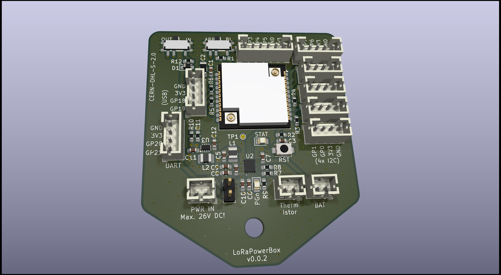
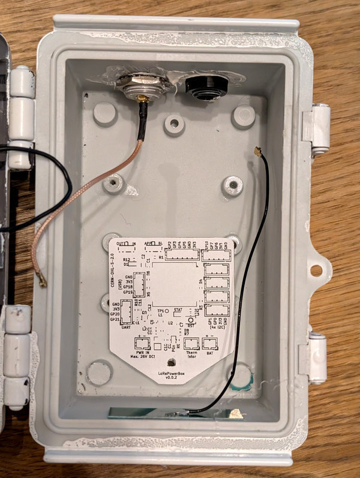
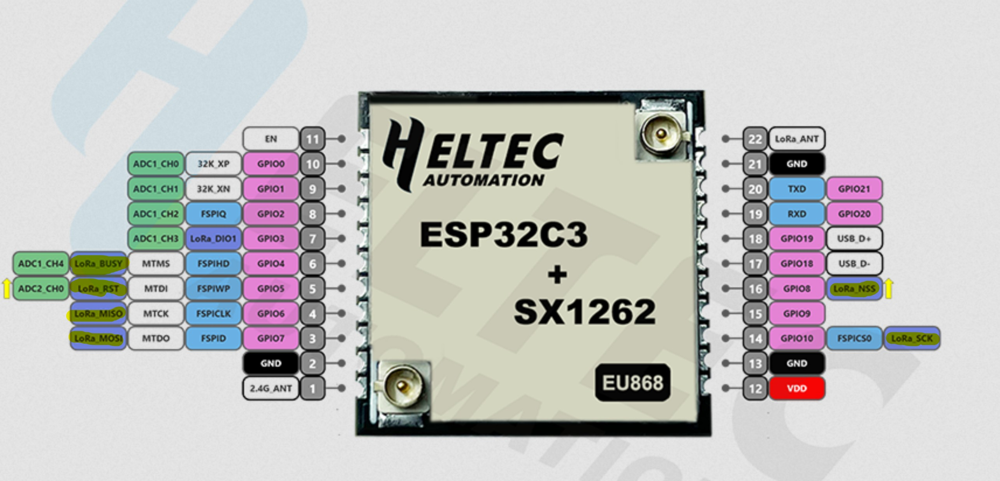

## What is this thing?

This PCB integrates a Heltec HT-CT62 (ESP32-C3 + SX1262), a TI BQ25628E wide-range Li-ion charger and a TI TPS631000 buck-boost converter providing a stable 3.3V rail at up to 1.5A. The TI BQ25628E is capable of handling highly dynamic sources like solar cells and wind generators.

## Features

- 3.9-18V input range, with survival up to 26 V  
- Up to 3.2A input current (IBUS)  
- Up to 2A battery charge current (IBAT)  
- Up to 3.5A system output current (ISW), limited to 1.5A @ 3.3V by the TPS631000  
- Configurable hot/cold charging profile to restrict charging at extreme temperatures  
- Integrated ADC provides full voltage / current telemetry via I²C  
- Pseudo-MPPT (VINDPM + IINDPM) for improved energy harvesting from solar/wind/etc. sources
- Full protection circuitry, allowing operation even with unprotected LiPo cells  

You can see this project as a successor of the [SolarMeshtasticNode](https://github.com/h0lad/SolarMeshtasticNode) project which was a reliable work horse - but showed several limitations. 
Improvements compared to the [SolarMeshtasticNode](https://github.com/h0lad/SolarMeshtasticNode):  

- No voltage dividers required - all measurements available via I²C from the charge controller
- No LED driver transistors needed
- Buck-architecture replaces inefficient LDO regulation
- Significantly improved access to interfaces

## Physical Outlines

The size of the PCB is 60mm x 51mm and is planned (= screw hole fits into housing) around following [Box (120x90x70)](https://de.aliexpress.com/item/1005005859929902.html). 

Do not use the transparent version: it will heat up.

**Simulation of the EdgeCut with a 1:1 print**

## Hardware Verification

PCB and components for v0.0.1 are ordered. Results will be available in 3-4 weeks.

## Warning if you are using LoRa 

The Semtech SX1262 consumes a significant number of GPIOs.

Available pins If LoRa is being used: GPIO0, GPIO1, GPIO18, GPIO19, GPIO20, GPIO21

Note that GPIO8 and GPIO9 are strapping pins and are sampled during early boot.

If the SX1262 is not used, it can be disabled via its CS line (GPIO8) from application code.
